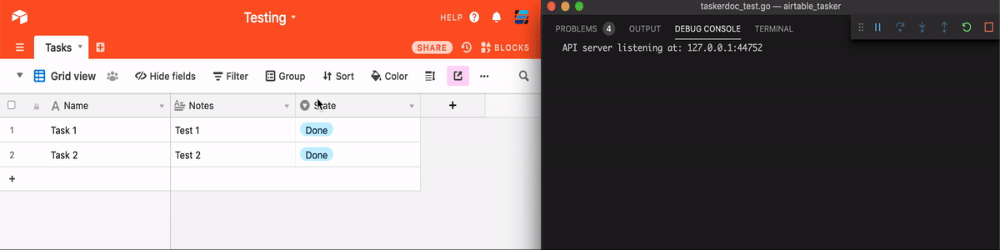

# Airtable Tasker

Airtable tasker is a simple library to make it easy to run backend go code based on an airtable frontend.

The library watches the airtable field named `State` and runs a function when the state is changed to the watching state.

## Example



## Usage

Set up an airtable base like [this one](https://airtable.com/shrrp5hz1D5JTb1HI).
Then write code to listen for any rows that have the State `ToDo`.

```go
func printTask(tasker *Tasker, task Task) {
    fmt.Println(task)
    // Make sure to change state after work is done!
    tasker.SetState(task.ID, "Done")
}

func main() {
    tasker, err := NewTasker(os.Getenv("AIRTABLE_KEY"), os.Getenv("AIRTABLE_BASE"))
    if err != nil {
        return
    }

    // Register function
    tasker.RegisterFunction("ToDo", printTask)

    // Start tasker
    tasker.Start(context.Background())
}
```
